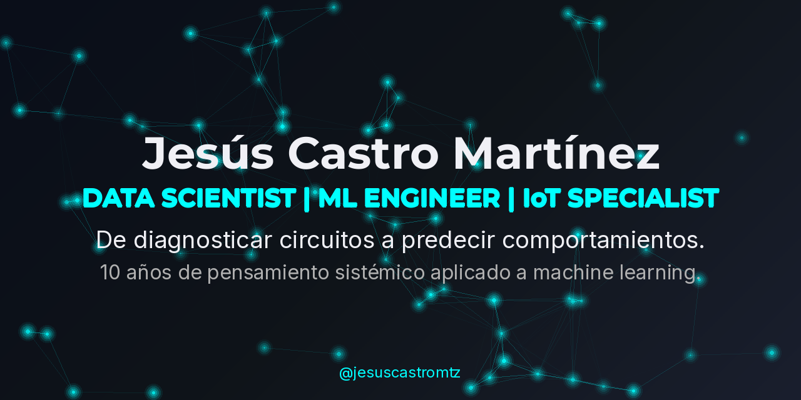

  

---

## 👋 Sobre Mí

De diagnosticar circuitos complejos a predecir comportamientos con Machine Learning.

**Ingeniero en Electrónica** con **10+ años** optimizando operaciones técnicas. Mi pasión por identificar patrones en fallas de hardware me llevó a la **Ciencia de Datos**, donde ahora aplico Machine Learning para:

- 📊 Predecir comportamientos y optimizar procesos
- 🔧 Automatizar decisiones basadas en datos
- 💰 Generar valor de negocio medible (ROI 18-21%, $95K mensuales)

### 🎯 Mi Diferenciador

Combino conocimiento profundo de **sistemas físicos** (IoT, sensores, electrónica) con **análisis de datos avanzado**, ideal para proyectos de:
- Mantenimiento predictivo
- Optimización industrial
- Análisis de señales y series temporales
- Cualquier desafío donde hardware y datos se cruzan

### 📍 Estado Actual

- 🎓 **Formación:** Científico de Datos (TripleTen, Mar-Dic 2025) | Ingeniería Electrónica (ITSLP, 2010)
- 📍 **Ubicación:** San Luis Potosí, México
- 🔍 **Buscando:** Roles como Data Scientist, ML Engineer o Data Analyst con enfoque en IoT/Industrial
- 💼 **Experiencia:** 10 años en electrónica + proyectos end-to-end en ML

---

## 🚀 Proyectos Destacados

### 📊 [Predicción de Churn en Telecomunicaciones End-to-End](https://github.com/jesuscastromtz/telecom-churn-prediction)

**El Desafío:**  
Una empresa de telecomunicaciones enfrentaba alta tasa de abandono de clientes sin identificar causas ni poder actuar preventivamente.

**Mi Solución:**  
Pipeline completo de ML integrando 4 fuentes de datos (contratos, servicios, llamadas, pagos) con feature engineering avanzado:
- Creé 20+ variables derivadas (antigüedad, eficiencia de pago, patrones de uso)
- Comparé 6 algoritmos con validación estratificada
- Manejé desbalanceo de clases (80% leales, 20% churn)

**Resultados de Impacto:**
- ✅ **AUC-ROC: 97.77%** | **Precisión: 94.53%** (Regresión Logística)
- ✅ **ROI estimado: 18-21%** mejora vs baseline sin modelo
- ✅ **Insight clave:** Contratos mes a mes tienen 2x más riesgo de abandono
- ✅ **Acción:** Segmentación de clientes permitió enfocar campañas de retención de forma rentable

**Tech Stack:** `Python` `scikit-learn` `XGBoost` `Pandas` `imbalanced-learn` `Matplotlib` `Seaborn`

[🔗 Ver Código](https://github.com/jesuscastromtz/telecom-churn-prediction-end-to-end)
<!-- | [📊 Notebook Interactivo](https://github.com/jesuscastromtz/telecom-churn-prediction/blob/main/notebooks/analisis.ipynb) -->

---

### 💰 [Predicción de Churn Bancario con con Técnicas de Remuestreo](https://github.com/jesuscastromtz/bank-churn-prediction)

**El Desafío:**  
Beta Bank enfrenta costos asimétricos (adquisición $500 vs retención $100) en contexto de datos desbalanceados (79% leales, 21% churn).

**Mi Solución:**  
- **Random Forest con upsampling** para manejar desbalanceo
- **GridSearchCV** para maximizar F1-Score (no accuracy)
- **Segmentación en 3 tiers de riesgo** para estrategias diferenciadas

**Resultados de Impacto:**
- ✅ **F1-Score: 0.62** | **Recall: 69%** (detecta correctamente 69% de clientes en riesgo)
- ✅ **ROI: 7.3x** al enfocarse en retención vs adquisición
- ✅ **Beneficio neto proyectado: $95.2K mensuales** (base 10,000 clientes)
- ✅ **Estrategia accionable:** Tier 1 (alto riesgo) → llamada personal, Tier 2 → email, Tier 3 → campaña genérica

**Tech Stack:** `Python` `scikit-learn` `pandas` `imbalanced-learn` `matplotlib` `seaborn`

[🔗 Ver Código](https://github.com/jesuscastromtz/bank-churn-imbalanced-classification-ml)

---

### 🚕 [Predicción de Demanda de Taxis con Series Temporales](https://github.com/jesuscastromtz/taxi-demand-forecasting)

**El Desafío:**  
Sweet Lift Taxi necesitaba predecir demanda en horas pico para optimizar asignación de conductores (objetivo: RMSE ≤ 48).

**Mi Solución:**  
En lugar de lanzarme a algoritmos complejos, invertí en **feature engineering estratégico**:
- Lags temporales (1h, 2h, 24h, 168h)
- Medias móviles (3h, 6h, 24h)
- Variables de estacionalidad (hora, día, fin de semana)
- Tendencias y diferencias

**Resultados de Impacto:**
- ✅ **RMSE: 35.12** (27% mejor que objetivo)
- ✅ **Regresión Lineal con features** superó a XGBoost, Random Forest y CatBoost
- ✅ **Lección clave:** Feature engineering bien diseñado > Algoritmos sofisticados
- ✅ **Mejora operativa:** Reducción estimada del 27% en tiempos de espera

**Tech Stack:** `Python` `pandas` `statsmodels` `scikit-learn` `LightGBM` `XGBoost` `CatBoost`

[🔗 Ver Código](https://github.com/jesuscastromtz/taxi-demand-forecasting-time-series)

---

### 🎬 [Análisis de Sentimiento en Reseñas de Cine con NLP (TF-IDF vs BERT)](https://github.com/jesuscastromtz/sentiment-analysis-nlp)

**El Desafío:**  
Clasificar 50,000 reseñas de IMDb como positivas o negativas para moderación automática de contenido (umbral: F1 > 0.85).

**Mi Solución:**  
Comparé enfoque clásico vs moderno para evaluar trade-offs:
- **TF-IDF + Regresión Logística** (tradicional, rápido, interpretable)
- **BERT embeddings** (estado del arte, computacionalmente intensivo)

**Resultados de Impacto:**
- ✅ **F1-Score: 0.883** (Regresión Logística + TF-IDF)
- ✅ **Superó a BERT** (F1: 0.865) en esta tarea específica
- ✅ **Lección clave:** Lo simple bien ejecutado puede superar a deep learning
- ✅ **Valor operacional:** Filtrado con 88% de precisión, costo computacional bajo

**Tech Stack:** `Python` `scikit-learn` `NLTK` `spaCy` `Transformers (BERT)` `matplotlib` `wordcloud`

[🔗 Ver Código](https://github.com/jesuscastromtz/movie-sentiment-analysis-nlp)

---

### 🔍 [Verificación de Edad por Computer Vision para Cumplimiento Normativo](https://github.com/jesuscastromtz/age-verification-cv)

**El Desafío:**  
Retail con 15% error en verificación manual de edad (multas $10K+ por infracción). Necesidad de solución automatizada.

**Mi Solución:**  
- **Transfer Learning con ResNet50** para estimar edad desde imágenes faciales
- **Data augmentation** para mejorar generalización
- **Evaluación con MAE** (Mean Absolute Error)

**Resultados y Aprendizajes:**
- ⚠️ **MAE: 13.57 años** (insuficiente para producción directa)
- ✅ **Diagnóstico:** Regresión de edad exacta es demasiado compleja para variabilidad humana
- ✅ **Roadmap propuesto:** Reformular como **clasificación binaria** (¿mayor/menor de 21?)
- ✅ **Potencial estimado:** 80% reducción en ventas ilegales con enfoque correcto
- ✅ **Valor demostrado:** Capacidad de diagnóstico técnico y pensamiento estratégico

**Tech Stack:** `Python` `TensorFlow` `Keras` `ResNet50` `OpenCV` `matplotlib`

[🔗 Ver Código](https://github.com/jesuscastromtz/age-verification-cv-system)

---

## 🛠️ Stack Técnico

### 🔌 De Hardware a Software: Mi Evolución

| 🔌 Era Hardware (2010-2020) | 📊 Era Data Science (2024-Presente) |
|------------------------------|-------------------------------------|
| **Microcontroladores** (Arduino, ESP32) | **Python** (Pandas, NumPy, Scikit-learn) |
| **Análisis de señales** (FFT, filtros) | **Time Series** (SARIMA, Prophet, LSTM) |
| **Sistemas embebidos** | **ML Deployment** (Docker, FastAPI, MLflow) |
| **Protocolos seriales** (I2C, SPI, UART) | **APIs REST** (FastAPI, Flask) |
| **Diagnóstico de fallas** | **Feature Engineering & EDA** |

**La Constante:** Pensamiento sistemático y analítico para resolver problemas complejos.

---

### 💻 Lenguajes & Frameworks

**Core:**   

**Machine Learning & Deep Learning:**       

**Data Analysis & Manipulation:**      

**Tools & DevOps:**       

**Databases:**   

**Specialized:**     

---

## 📊 GitHub Stats

  <!-- Esta imagen se genera sola y no se rompe nunca -->
  

---

## 🏆 Logros Destacados

### 💼 Experiencia Profesional

- 🔧 **10+ años** liderando equipos técnicos en Multi-sistemas Electrónicos (Samsung, LG, Sony)
- 📊 **Reducción del 20%** en tiempos de reparación mediante análisis de patrones históricos
- 🏅 **Mejor ranking regional** en servicio al cliente (NPS)
- 🎯 **30% menos reincidencias** en fallas mediante análisis root-cause documentado

### 🎓 Formación & Reconocimientos

- 🎓 **Científico de Datos** - TripleTen Bootcamp (Mar-Dic 2025)
  - 600+ horas prácticas
  - 5 proyectos end-to-end con datasets reales
  - Especialización en ML, NLP, Computer Vision y Series Temporales

---

## 📈 Lo Que Estoy Aprendiendo Ahora

- 🔥 **MLOps:** Deployment de modelos con FastAPI + Docker
- 🧠 **Deep Learning avanzado:** Transformers y arquitecturas custom con PyTorch
- 📊 **Real-time Analytics:** Apache Kafka + Spark Streaming
- 🤖 **LLMs:** Fine-tuning de modelos de lenguaje (GPT, LLaMA)

---
## 🤝 Hablemos de Datos y Resultados

 

### 📫 ¿Listo para transformar tus procesos?

Busco mi próximo reto como **Data Scientist** o **ML Engineer**. Aporto una visión híbrida única: la precisión del **Hardware** con la potencia de la **Inteligencia Artificial**.

**¿En qué puedo ayudarte?**
*   ⚙️**Optimización Industrial:** Aplicando modelos de ML para reducir tiempos muertos.
*   🏭 **Mantenimiento Predictivo:** Anticipando fallas antes de que ocurran.
*   📡 **Estrategia IoT:** Transformando señales de sensores en decisiones de negocio.
*   💼 **Liderazgo Técnico:** Guiando equipos hacia soluciones de datos escalables.

**¿Tienes un desafío en mente?** Hagamos que los datos trabajen para ti.

---

### *"No solo analizo datos. Entiendo cómo se generan físicamente."*

---

⭐ **Si encuentras valor en mi trabajo, considera darle una estrella a mis repositorios**

